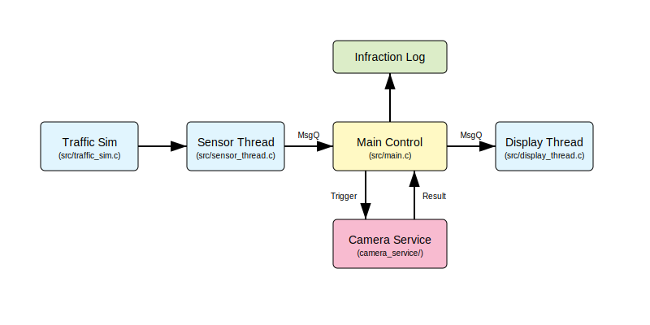

# Radar Eletrônico com Classificação de Veículos (Zephyr RTOS)

## Alunos
- Saulo Roberto dos Santos
- Camila Maria Farias Silva

## Sobre o Projeto

Este projeto implementa um sistema simulado de radar eletrônico utilizando o **Zephyr RTOS** na plataforma `mps2_an385` (emulada via QEMU). O sistema é capaz de detectar a passagem de veículos, calcular sua velocidade, classificar entre veículos leves e pesados, exibir o status em um display virtual (com cores ANSI no terminal) e simular o acionamento de uma câmera para registro de infrações.

## Funcionalidades

*   **Detecção de Velocidade:** Calcula a velocidade com base no tempo de passagem entre dois sensores virtuais.
*   **Classificação de Veículos:**
    *   **Leve:** Até 2 eixos (pulsos no primeiro sensor).
    *   **Pesado:** 3 ou mais eixos.
*   **Monitoramento de Infrações:**
    *   Limites de velocidade configuráveis independentes para veículos leves e pesados.
    *   Zona de alerta (amarelo) configurável (ex: 90% do limite).
*   **Feedback Visual:** Utiliza códigos de cores ANSI no terminal para simular um display:
    *   🟢 **Verde:** Velocidade Normal.
    *   🟡 **Amarelo:** Alerta (próximo do limite).
    *   🔴 **Vermelho:** Infração (Câmera acionada).
*   **Simulação de Câmera (LPR):**
    *   Acionada via **ZBUS** apenas em caso de infração.
    *   Gera placas no padrão Mercosul aleatórias.
    *   Simula falhas de leitura com taxa configurável.
    *   Valida o formato da placa antes de exibir.
*   **Simulação de Tráfego:** Um módulo de simulação gera automaticamente veículos com diferentes perfis (velocidade e tipo) – incluindo casos “Normal”, “Alerta” e “Infração” – para demonstrar o funcionamento sem necessidade de interação manual complexa no QEMU.
*   **Registro Interno de Infrações:** Armazenamento em buffer circular (ring buffer) com timestamp, tipo de veículo, velocidade, limite aplicado, status de leitura da câmera e placa (quando válida). Contadores agregados por tipo e por sucesso/falha de leitura.

## Arquitetura do Sistema

O software é estruturado em múltiplas threads comunicando-se via **Message Queues** e **ZBUS**:



1.  **Sensor Thread (`src/sensor_thread.c`):**
    *   Monitora interrupções de GPIO (simuladas).
    *   Conta eixos para classificação.
    *   Mede o tempo entre o sensor inicial e final.
    *   Envia dados brutos (tempo, eixos) para a Thread Principal.

2.  **Main Control Thread (`src/main.c`):**
    *   Recebe dados dos sensores.
    *   Calcula a velocidade em km/h.
    *   Aplica a lógica de limite de velocidade baseada no tipo de veículo.
    *   Determina o status (Normal, Alerta, Infração).
    *   Envia dados para o Display.
    *   Publica trigger para a Câmera (via ZBUS) se houver infração.
    *   Consome resultados da Câmera (via ZBUS) e atualiza o display com a placa.

3.  **Display Thread (`src/display_thread.c`):**
    *   Recebe pacotes de estado da Thread Principal.
    *   Formata a saída com cores ANSI e imprime no console/UART.

4.  **Camera Service (`camera_service/`):**
    *   Módulo externo (Zephyr extra module) habilitado via `CONFIG_CAMERA_SERVICE`.
    *   Exponibiliza a API `camera_api_capture()` e o canal `chan_camera_evt`.
    *   Simula tempo de captura, seleciona placas válidas/ inválidas e publica o resultado.

5.  **Traffic Sim (`src/traffic_sim.c`):**
    *   Injeta dados simulados (incluindo velocidades em faixa de alerta) na fila de sensores para validação automática do sistema no QEMU.
6.  **Registro de Infrações (`src/infraction_log.c` / `src/infraction_log.h`):**
    *   Mantém um histórico em buffer circular com contadores agregados.
7.  **Utilitários (`src/utils.c`):**
    *   Expõe funções compartilhadas como `calculate_speed` e `validate_plate`, usadas pelo firmware e pelos testes.
8.  **FSM dos Sensores (`src/sensor_fsm.h`):**
    *   Define a máquina de estados inline responsável por contabilizar eixos e medir o intervalo entre sensores.


### Estrutura de Arquivos Principais

| Caminho                          | Descrição resumida                                      |
|---------------------------------|----------------------------------------------------------|
| `src/main.c`                    | Thread principal, telemetria e orquestração              |
| `src/sensor_thread.c`           | Interrupções GPIO e FSM de sensores                      |
| `src/sensor_fsm.h`              | Máquina de estados inline (start/end/finalize)           |
| `src/display_thread.c`          | Saída ANSI (verde/amarelo/vermelho)                      |
| `camera_service/`               | Serviço de câmera compartilhado (API + thread própria)   |
| `src/infraction_log.{c,h}`      | Ring buffer e contadores de infrações                    |
| `src/utils.c`                   | Funções utilitárias (placa + cálculo de velocidade)      |
| `src/traffic_sim.c`             | Gerador automático de tráfego (Normal/Alerta/Infração)   |
| `tests/unit/test_logic.c`       | Testes de cálculo, classificação e validação de placa    |
| `tests/unit/test_fsm.c`         | Testes unitários da FSM de sensores                      |
| `tests/integration/test_integration.c` | Teste do fluxo ZBUS (publish/subscribe)           |

## Configuração (Kconfig)

As seguintes opções podem ser ajustadas no arquivo `prj.conf` ou via `west build -t menuconfig`:

*   `CONFIG_RADAR_SENSOR_DISTANCE_MM`: Distância entre os sensores (padrão: 5000mm).
*   `CONFIG_RADAR_SPEED_LIMIT_LIGHT_KMH`: Limite para veículos leves (padrão: 60 km/h).
*   `CONFIG_RADAR_SPEED_LIMIT_HEAVY_KMH`: Limite para veículos pesados (padrão: 40 km/h).
*   `CONFIG_RADAR_WARNING_THRESHOLD_PERCENT`: % do limite para ativar alerta amarelo (padrão: 90%).
*   `CONFIG_RADAR_CAMERA_FAILURE_RATE_PERCENT`: Probabilidade de falha na leitura da câmera (padrão: 10%).
*   `CONFIG_RADAR_QUEUE_DEPTH`: Profundidade das filas de mensagens (padrão: 10).
*   `CONFIG_RADAR_INFRACTION_LOG_SIZE`: Tamanho do ring buffer de infrações (padrão: 32).
*   `CONFIG_RADAR_AXLE_TIMEOUT_MS`: Timeout de contagem de eixos antes de finalizar a medição (padrão: 2000 ms).

## Instruções de Execução

### Pré-requisitos
*   Zephyr SDK instalado e configurado.
*   QEMU para ARM (`qemu-system-arm`).

### 1. Compilar
Para compilar o projeto para a placa `mps2_an385` (Cortex-M3):

```bash
west build -b mps2/an385 --pristine
```

### 2. Executar (Simulação)
Para rodar no QEMU e ver a simulação de tráfego em tempo real:

```bash
west build -t run
```

O terminal exibirá o log do sistema e os "displays" coloridos conforme os veículos são simulados.

### 3. Sair do QEMU
Pressione `Ctrl+a` e solte, depois pressione `x`.

## Testes Automatizados

O projeto inclui testes unitários (lógica) e de integração (ZBUS) utilizando o framework **Ztest**.

### Rodar Testes Unitários
As suites em `tests/unit` são executadas com o Twister (framework oficial do Zephyr):

```bash
west twister  -p mps2/an385 -T tests/unit -vvv
```

### Rodar Testes de Integração

```bash
west twister -p mps2/an385 -T tests/integration -vvv
```

## Exemplo de Saída

```text
[00:00:07.020,000] <inf> traffic_sim: SIMULATION: Generating Heavy Vehicle (50 km/h - Infraction!)
[00:00:07.040,000] <inf> main_control: Speed Calc: 50 km/h (Limit: 40). Status: 2

========================================
 RADAR STATUS: INFRACTION 
 Velocidade: 50 km/h
 Limite: 40 km/h (Alerta ≥ 36 km/h)
 Veiculo: Pesado (Eixos: 3)
========================================

[00:00:07.040,000] <inf> camera_thread: Camera Triggered! Processing...
[00:00:07.550,000] <inf> camera_thread: Camera Result: CGI7R63
[00:00:07.560,000] <inf> main_control: Valid Plate: CGI7R63. Infraction Recorded.

========================================
 RADAR STATUS: INFRACTION 
 Velocidade: 50 km/h
 Limite: 40 km/h (Alerta ≥ 36 km/h)
 Veiculo: Pesado
 Placa: CGI7R63
========================================
```

## Limitações e Suposições

*   Simulação de sensores: Em QEMU (mps2_an385), a injeção de interrupções de GPIO a partir de software é limitada. Para demonstrar o fluxo completo sem interação manual, o módulo `traffic_sim` injeta eventos diretamente na fila de sensores, não através de GPIO reais.
*   Display: O “Display Dummy” imprime no console com cores ANSI. Não há framebuffer real; a visualização é textual.
*   Aleatoriedade da câmera: Durante testes (`CONFIG_TEST=y`), a geração de placas é determinística (RNG fixo) para reprodutibilidade. Em execução normal, usa gerador pseudo-aleatório do Zephyr.
*   Precisão: O cálculo de velocidade assume distância entre sensores configurada corretamente e resolução de tempo baseada em `k_uptime_get()`. Leituras muito curtas podem sofrer discretização.
*   Carga/Filas: Em saturação das filas, a política é “drop oldest” para priorizar eventos recentes, com logs de aviso.